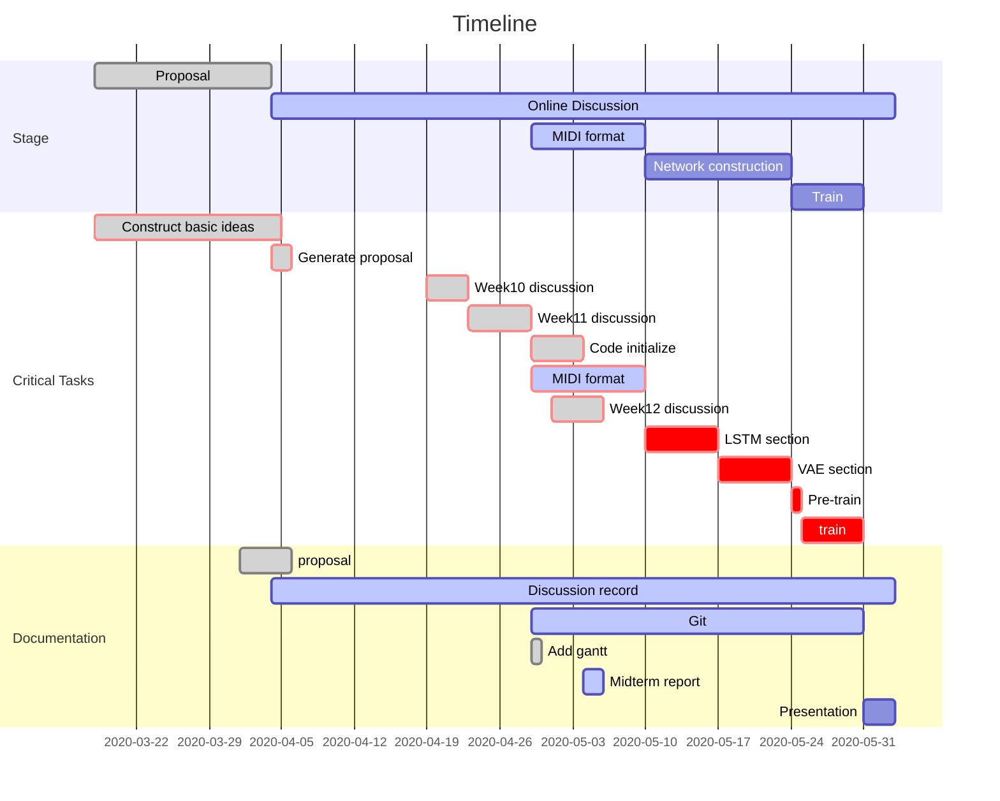

```mermaid
  gantt
  dateFormat  YYYY-MM-DD
  title Timeline

  section Stage
  Proposal				:done,    des0, 2020-03-18, 2020-04-04
  Online Discussion     :active,  des1, 2020-04-04, 2020-06-03
  MIDI format       	:active,  des4, 2020-04-29, 2020-05-10
  Network construction  :         des5, 2020-05-10, 2020-05-24
  Train					:		  des6, 2020-05-24, 2020-05-31
  

  section Critical Tasks
  Construct basic ideas               :crit, done,    2020-03-18, 2020-04-05
  Generate proposal                   :crit, done,    2020-04-04, 2020-04-06
  Week10 discussion                   :crit, done,    2020-04-19, 2020-04-23
  Week11 discussion                   :crit, done,    6d
  Code initialize   				  :crit, done,    2020-04-29, 2020-05-04
  MIDI format                         :crit, active,  2020-04-29, 2020-05-10
  Week12 discussion                   :crit, done,    2020-05-01, 2020-05-06
  LSTM section						  :crit,          2020-05-10, 2020-05-17
  VAE section						  :crit,          2020-05-17, 2020-05-24
  Pre-train							  :crit,          2020-05-24, 2020-05-25
  train								  :crit,		  2020-05-25, 2020-05-31

  section Documentation
  proposal 			  			      :done, 		  2020-04-01, 2020-04-06
  Discussion record					  :active, 		  2020-04-04, 2020-06-03
  Git				                  :active, 		  2020-04-29, 2020-05-31
  Add gantt                           :done, 		  2020-04-29, 2020-04-30
  Midterm report                      :active, 		  2020-05-04, 2020-05-06
  Presentation						  :		          2020-05-31, 2020-06-03
  
```