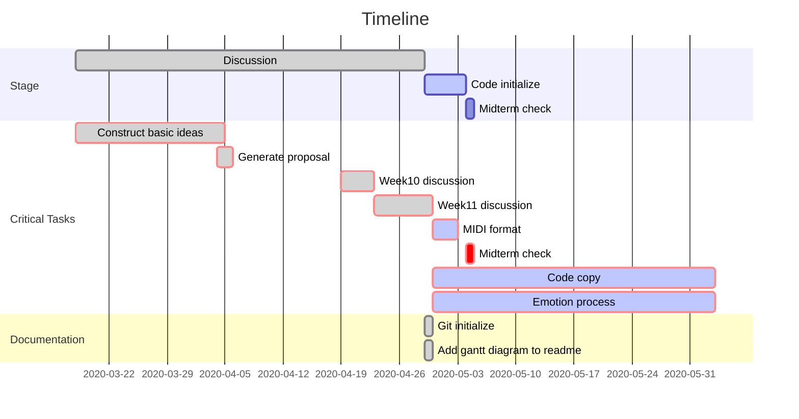

```mermaid
  gantt
  dateFormat  YYYY-MM-DD
  title Timeline

  section Stage
  Discussion        :done,    des1, 2020-03-18, 2020-04-29
  Code initialize   :active,  des2, 2020-04-29, 2020-05-04
  Midterm check     :         des3, 2020-05-04, 2020-05-05

  section Critical Tasks
  Construct basic ideas               :crit, done,    2020-03-18, 2020-04-05
  Generate proposal                   :crit, done,    2020-04-04, 2020-04-06
  Week10 discussion                   :crit, done,    2020-04-19, 2020-04-23
  Week11 discussion                   :crit, done,    7d
  MIDI format                         :crit, active,  2020-04-30, 2020-05-03
  Midterm check                       :crit,          2020-05-04, 2020-05-05
  Code copy                           :crit, active,  2020-04-30, 2020-06-03
  Emotion process                     :crit, active,  2020-04-30, 2020-06-03

  section Documentation
  Git initialize                      :done, a1, after des1, 1d
  Add gantt diagram to readme         :done, a1, after des1, 1d
```